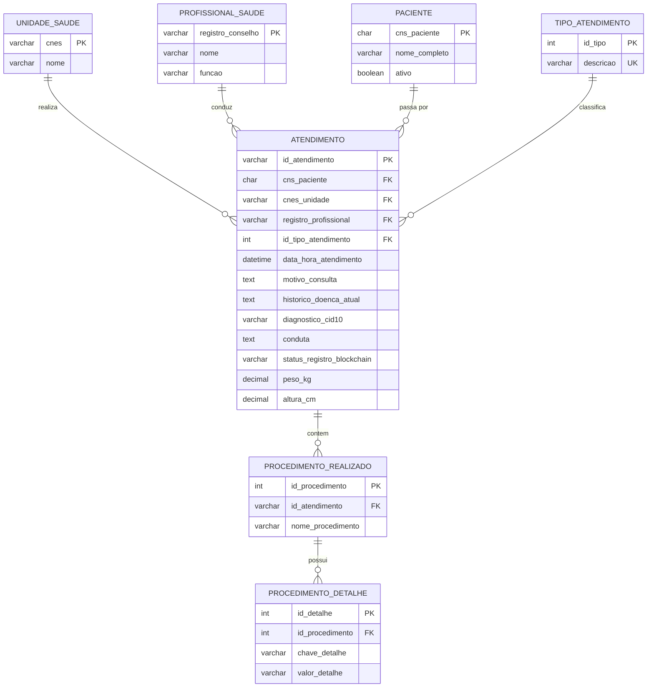

# Diagrama Entidade-Relacionamento (DER)

```mermaid
erDiagram
    UNIDADE_SAUDE {
        varchar cnes PK
        varchar nome
    }

    ATENDIMENTO {
        varchar id_atendimento PK
        char cns_paciente FK
        varchar cnes_unidade FK
        varchar registro_profissional FK
        int id_tipo_atendimento FK
        datetime data_hora_atendimento
        text motivo_consulta
        text historico_doenca_atual
        varchar diagnostico_cid10
        text conduta
        varchar status_registro_blockchain
        decimal peso_kg
        decimal altura_cm
    }

    PROFISSIONAL_SAUDE {
        varchar registro_conselho PK
        varchar nome
        varchar funcao
    }

    PACIENTE {
        char cns_paciente PK
        varchar nome_completo
        boolean ativo
    }

    TIPO_ATENDIMENTO {
        int id_tipo PK
        varchar descricao UK
    }

    PROCEDIMENTO_REALIZADO {
        int id_procedimento PK
        varchar id_atendimento FK
        varchar nome_procedimento
    }

    PROCEDIMENTO_DETALHE {
        int id_detalhe PK
        int id_procedimento FK
        varchar chave_detalhe
        varchar valor_detalhe
    }

    UNIDADE_SAUDE ||--o{ ATENDIMENTO : "realiza"
    PROFISSIONAL_SAUDE ||--o{ ATENDIMENTO : "conduz"
    PACIENTE ||--o{ ATENDIMENTO : "passa por"
    TIPO_ATENDIMENTO ||--o{ ATENDIMENTO : "classifica"
    ATENDIMENTO ||--o{ PROCEDIMENTO_REALIZADO : "contem"
    PROCEDIMENTO_REALIZADO ||--o{ PROCEDIMENTO_DETALHE : "possui"
```
